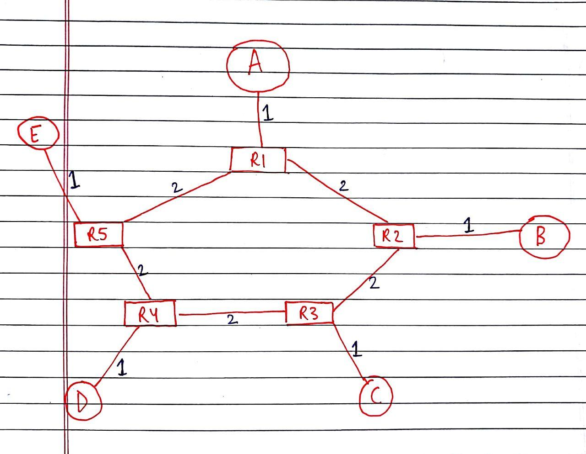
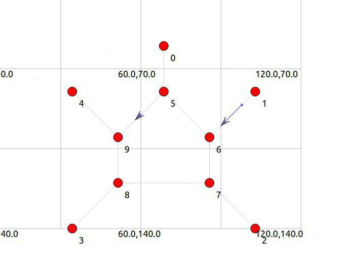
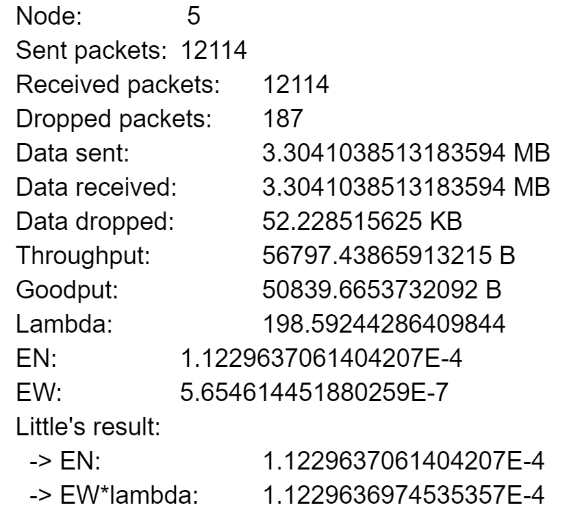

# ns3_assignments

Simulating a computer network using ns-3 in C++, NetAnim and evaluate its performance.

Below is the topology that we simulated.

## Topology

## Simulation

## Decisions Taken

- Number of routers: 5
- No. Of workstations/servers : 5
- Packet length : 2048 bits
- Propagation Delay: 1 ms
- Packet drop rate: 0.54 per cent
- Simulation Time: 1 minute
- Servers acting as sources: A,B,C,D,E
- Servers acting as sinks: A,B,C,D,E
- Networking Protocol for sending packets :UDP

## Details of the solution

- Inter arrival times between packets
- Packet drops
- Queue length
- End to end one way Delays
- Static Routing

## Inter arrival time

Setting a Poisson distribution for inter arrival times between packets

- Utilized the on time and off time of servers
- Set on time sufficient to transmit one packet of data.
- Modelled the off time as an Exponential Random variable
- Exponential Random Variable closest to Poisson in the distributions provided

## Packet Drops

- RateErrorModel Class used
- Set a constant error rate for simulating packet drops.

## Queue Length

- Utilized Little’s Theorem
- N = Lambda * T
- Lambda = Mean inter arrival time/unit time
- T = Time period for which the simulation is run

## End to end one way Delays

- Computed using trace files
- Trace files looked somewhat like this
- Provide information for each node

## Static Routing

- Implemented using Ipv4StaticRoutingHelper functionality
- Point to point  Helper used for building links

Thanks for reading!